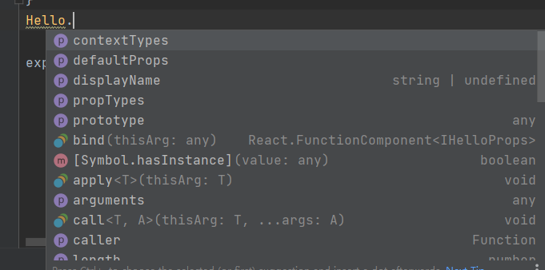
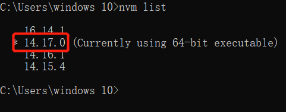

# 1、初始化ts+react项目

```
npx create-react-app name --template typescript
```

# 2、用ts写一个hello world
### 简单写一个函数式组件

```tsx
import React from "react";
const Hello = (props: any) => {
    return <h2>{ props.message }</h2>
}
export default Hello
```
### 上面用到any不太好，我们定义一个接口,使用props时没有提示

```tsx
import React from "react";
interface IHelloProps {
    message: string
}
const Hello = (props: IHelloProps) => {
    return <h2>{ props.message }</h2>
}
export default Hello

```
### React.FunctionComponent

```tsx
import React from "react";

interface IHelloProps {
    message?: string
}
const Hello: React.FunctionComponent<IHelloProps> = (props) => {
    return <h2>{ props.message }</h2>
}
Hello.defaultProps = {
    message: 'hello wangling'
}

export default Hello

```

你会发现多了很多提示



### FunctionComponent接口定义

```jsx
interface FunctionComponent<P = {}> {
        (props: PropsWithChildren<P>, context?: any): ReactElement<any, any> | null;
        propTypes?: WeakValidationMap<P> | undefined;
        contextTypes?: ValidationMap<any> | undefined;
        defaultProps?: Partial<P> | undefined;
        displayName?: string | undefined;
    }
```


### React.FC

FC是FunctionComponent的简写

FC的类型定义

```ts
type FC<P = {}> = FunctionComponent<P>;
```

```tsx
interface IHelloProps {
    message?: string
}
const Hello: React.FC<IHelloProps> = (props) => {
    return <h2>{ props.message }</h2>
}
Hello.defaultProps = {
    message: 'hello wangling'
}

export default Hello
```

# 3、classnames使用
```bash
// 安装
npm i classnames -S
npm i @types/classnames -S
// 使用
import classnames from 'classnames'
const classNames = classnames('btn', className, {
[`btn-${buttonSize}`]: buttonSize,
[`btn-${buttonType}`]: buttonType,
'btn-disabled': buttonType === ButtonType.Link && disabled
})
```

# 4、button组件编写
原生的参数
```ts
// 交叉类型 把两种类型合并在一起
type NativeButtonProps = BaseButtonsProps & React.ButtonHTMLAttributes<HTMLElement>
type anchorButtonProps = BaseButtonsProps & React.AnchorHTMLAttributes<HTMLElement>
export type ButtonProps = Partial<NativeButtonProps & anchorButtonProps>
```

# 5、单元测试Jest
https://www.jestjs.cn/
react里面内置了Jest,直接使用npm run test可以运行起来
> 注意：期间我遇到了一个问题 一直运行不成功，跟node版本有关,用14.17.0可以运行

```bash
npx jest 测试名称
npx jest 测试名称 --watch
```
看文档我们可以看jest
jest-dom增加了一些dom的断言

### react用到测试单元插件
  - "@testing-library/jest-dom": "^5.16.2", 增加了一些dom的断言
  - "@testing-library/react": "^11.2.7", 常用的断言
  - "@testing-library/user-event": "^13.5.0",


# 6、react字体图标
- https://www.npmjs.com/package/@fortawesome/react-fontawesome
- https://fontawesome.com/v6/docs/web/use-with/react/
- https://fontawesome.cn/#
- https://fontawesome.dashgame.com/
- https://github.com/FortAwesome/react-fontawesome/
- https://fontawesome.com/v6/docs/web/use-with/react/

### 字体图标使用
```bash
"@fortawesome/fontawesome-svg-core": "^6.1.0",
"@fortawesome/free-regular-svg-icons": "^6.1.0",
"@fortawesome/free-solid-svg-icons": "^6.1.0",
"@fortawesome/react-fontawesome": "^0.1.18",
```


```react
import {  FontAwesomeIcon } from '@fortawesome/react-fontawesome'
import { faCoffee } from "@fortawesome/free-solid-svg-icons"
<FontAwesomeIcon icon={faCoffee}></FontAwesomeIcon>
```

# 动画transition
```js
npm install react-transition-group -S
```
https://www.jianshu.com/p/49fa164b938d


# storybook使用
官网 https://storybook.js.org/docs/react/configure/webpack#extending-storybooks-webpack-config
课程版本问题汇总 https://shimo.im/docs/tgP9yYy9jp8HtghT/read
安装
- 自动安装 - 不知道原因安装不成功
```js
npx -p @storybook/cli sb init
```
如果使用Create React APP ，你应当使用一下命令：
```js
npx -p @storybook/cli sb init --type react_scripts
```
- 手动安装
```js
npm install @storybook/react --save-dev

npm install react react-dom --save
npm install babel-loader @babel/core --save-dev
```
在package.json添加npm 命令：
```js
{
"scripts": {
  "storybook": "start-storybook"
}
}
```
创建 .storebook/main.js:
```js
module.exports = {
    stories: ['../src/**/*.stories.[tj]s'],
};
```
创建第一个Store，新建文件../src/index/stories.js :
```tsx
import React from 'react';
import { Button } from '@storybook/react/demo';

export default { title: 'Button' };

export const withText = () => <Button>Hello Button</Button>;

export const withEmoji = () => (
  <Button>
    <span role="img" aria-label="so cool">
      😀 😎 👍 💯
    </span>
  </Button>
);
```
遇到了一个问题用scss问题
https://github.com/storybookjs/presets/issues/220
